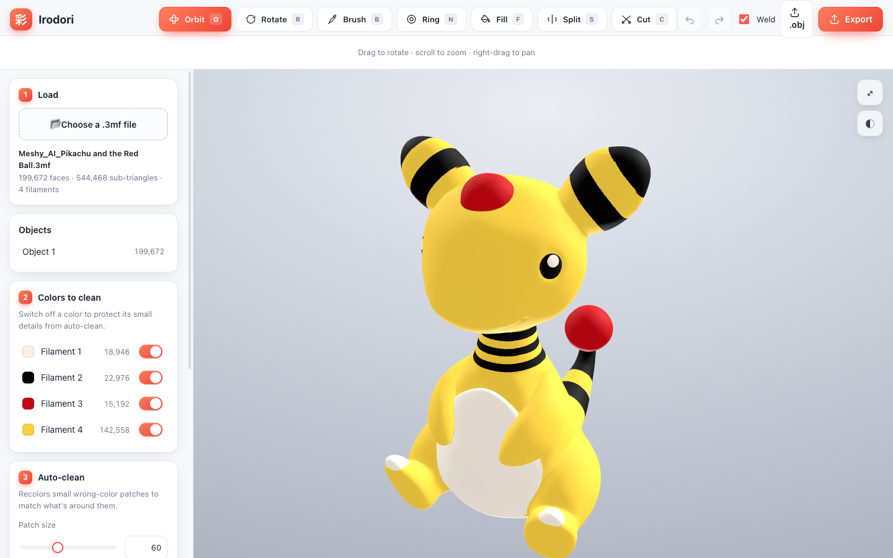
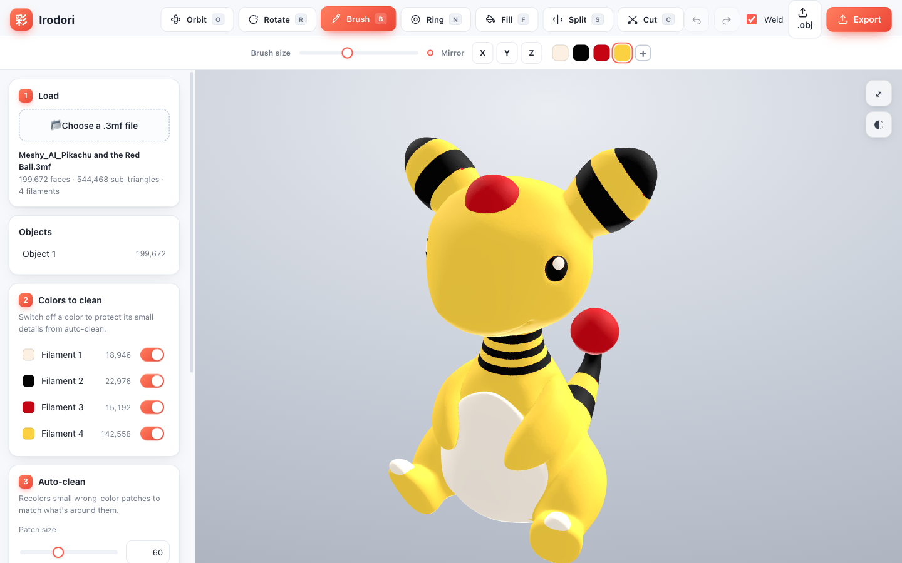
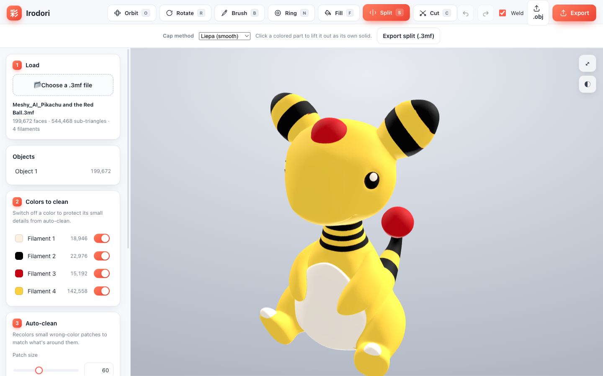
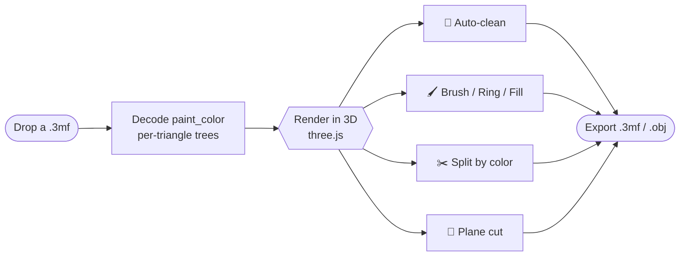
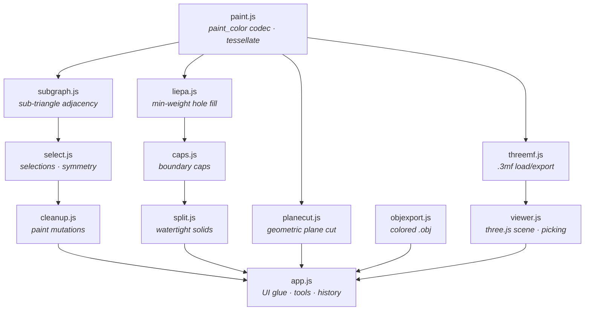

<div align="center">


# 彩 Irodori

**A browser-only studio for repairing, editing and splitting multi-color paint on `.3mf` models.**

*Irodori (彩) — “the tasteful arrangement of color.”*

<br/>


</div>

<div align="center">



</div>

---

## Why Irodori?

AI mesh generators (Meshy, Tripo, …) hand you a beautifully **textured** model.
But an AMS/MMU printer doesn't print textures — it prints with a handful of
filaments. The moment you quantize that texture down to 3–5 colors, the
boundaries fill with **stray-color speckle**: tiny blobs and thin lines of the
wrong filament that no slicer will clean up for you.

**Irodori is the missing step between "AI model" and "good color print."**
Drop in a `.3mf`, see exactly where the noise is, wipe it out in one click, then
hand-paint the details that matter — all in the browser, with **nothing ever
uploaded**.

> Load → clean → touch up → split → export. Five minutes, no install, no account,
> no cloud.

---

## What you can do

### 🧹 Auto-clean stray color

Recolor small wrong-color patches to match their surroundings, with a live
preview and a **patch-size** threshold so you decide what counts as "noise."
Switch any filament off to protect its fine details from the sweep.

### 🖌️ Paint like a slicer — only better

| Tool | What it does |
| --- | --- |
| **Brush** `B` | Paint by dragging; slicer-grade edge refinement runs on release. |
| **Ring** `N` | Wraps a colored band around the local feature; the axis follows the surface normal. |
| **Fill** `F` | Flood a connected same-color region (Color / Smart modes, angle threshold). |

Every tool shows an **on-surface hover preview**, and **X/Y/Z mirror painting**
can be combined so symmetric models stay symmetric.



### 🎨 Real, sliceable colors

Paint with the model's existing filaments or add new ones — added colors export
as **genuine sliceable filaments**, and every add/delete is undoable.

### ✂️ Split painted regions into watertight solids

Lift any connected colored region out as its own **watertight** part. Pick a cap
method (Liepa smooth fill by default), then export every part **plus the
remainder** as separate objects in a single `.3mf` — the cut surfaces stay
perfectly coincident.



### 🔪 Plane cut

Slice the whole mesh with a geometric plane — exact triangle clipping, welded
section points, flat caps. Great for splitting a model for a smaller print bed.

### 📦 Export anywhere

One-click **`.3mf`** (multi-mesh round-trip, filaments normalized to Generic
PLA) or colored **`.obj`** with a weld toggle for shared vs. split vertices.

---

## How it works



Everything — decode, geometry, repair, re-encode and export — happens on the
main thread in your tab. There is no server.

---

## Quick start

No build step. It's plain files served over HTTP:

```bash
python3 -m http.server 8000
# then open http://localhost:8000
```

> **Heads up:** after editing anything under `js/`, restart the server on a
> **new port** (or hard-reload). `http.server` + the browser's heuristic
> caching will happily serve stale modules and produce phantom
> "X is not a function" errors.

Run the tests (Node's built-in runner, **76 tests**):

```bash
npm test
```

---

## Architecture

Irodori is **vanilla JS with no framework and no bundler**. Each script is an
IIFE that attaches a global to `window`; the `<script>` order in `index.html`
*is* the dependency graph. Keep it that way.



| Module | Responsibility |
| --- | --- |
| `paint.js` | Bambu `paint_color` codec; `Paint.tessellate` is **the** geometry convention every subdivision must match. |
| `threemf.js` | `.3mf` zip load/export, multi-mesh round-trip, filament normalization. |
| `subgraph.js` / `select.js` / `cleanup.js` | The `Cleanup` namespace: cached sub-triangle adjacency, read-only selections + symmetry, and paint-mutating ops. |
| `liepa.js` | Liepa hole filling (rim decimation → 3-D min-weight DP → fan strips → refinement → fairing). |
| `caps.js` | Boundary-loop extraction and cap triangulation. |
| `split.js` | Watertight solids from sub-triangle sets; parts and remainder share one cut cap. |
| `planecut.js` | Exact triangle clipping with welded section points and flat earcut caps. |
| `viewer.js` | three.js scene, picking, explode animation, preview tints. |
| `app.js` | UI glue: tools, palette, history (snapshot/undo), panels. |

A test harness (`tests/harness.js`) loads these browser IIFEs into a Node `vm`
sandbox with vendored three.js + poly2tri, so the pure geometry is testable
headlessly. Watertightness is asserted as *every undirected edge used exactly
twice*; winding is covered by an area-weighted Liepa regression.

---

## The `paint_color` format (reverse-engineered)

Bambu/Prusa store per-triangle paint as a hex string whose **nibbles are read
right-to-left**. Each node is one nibble: the low 2 bits are `split_sides`
(`0` = leaf), the high 2 bits are the payload.

```text
node:
  split = nibble & 0b11
  field = nibble >> 2
  if split == 0:                         # leaf
      if field != 0b11: state = field                 # states 0..2
      else:                                            # escape
          s2 = nextNibble
          if s2 != 0b1110: state = s2 + 3             # states 3..16
          else: state = (lo | hi<<4) + 17             # states 17..255
  else:                                  # split into (split+1) children
      special_side = field
      children = (split + 1) nodes, read recursively
```

`state` is the 1-based filament index (state 0 = the object's default
extruder); colors come from `filament_colour` in
`Metadata/project_settings.config`. The codec in `js/paint.js` decodes and
re-encodes all **199,672 triangles** of the reference model with zero loss.

---

## Project layout

```
index.html        # script order = the dependency graph
css/style.css
js/               # the 12 modules above (load order matters)
tests/            # node --test; harness.js sandboxes the browser IIFEs
samples/          # the tracked reference model
vendor/           # three.js + poly2tri (vendored)
docs/             # specs, plans, and these assets
```

The reference model lives in `samples/`. See **`CLAUDE.md`** for the full module
map and contributor conventions. Specs live in `docs/superpowers/specs/`, plans
in `docs/superpowers/plans/` — read the relevant one before extending a feature.

---

<div align="center">

**Runs entirely in your browser — nothing is uploaded.**

</div>
